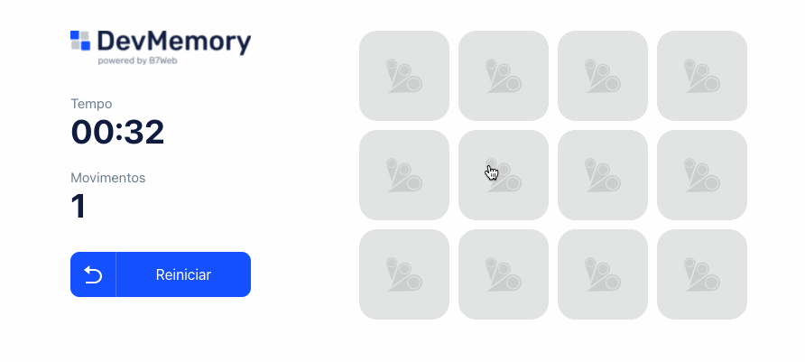

# JOGO DA MEMÓRIA - CURSO B7WEB

Esté é um projeto de um jogo da memória desenvolvido usando ReactJS e Typescript, desenvolvido durante o curso de ReactJs da b7wEB.

 

Ele contém as seguintes funcionalidades.

<ul>
    <li>Contagem de movimentos</li>
    <li>Timer</li>
    <li>Responsividade</li>
</ul>

Entre em contato por <a href="https://www.linkedin.com/in/seileremerson/" target="_blank">aqui</a>!

