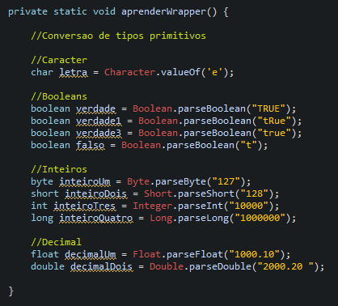

# Learning about Wrapper

## Wrapper
- Wrappers are known in the Java language as special classes that have methods capable of converting into primitive variables and also of encapsulating primitive types to be worked with as objects.
- Therefore, there is a Wrapper class for each primitive type identified by the same name as the type it has and having the first letter capitalized. This declaration rule applies to all types except those that are char classified as Character and int classified as Integer.

## Examples 

