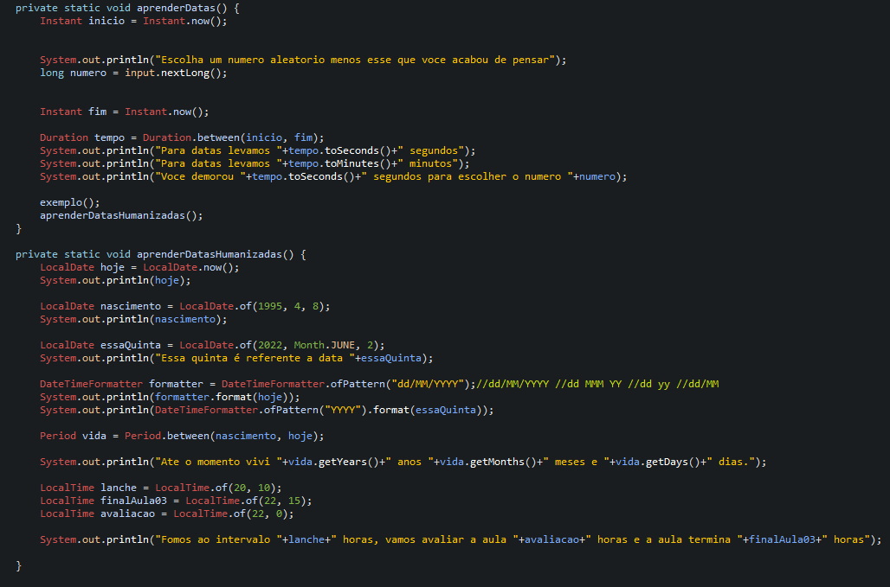

# Learning about HashSet

A special collection that has usage rules
It does not allow for duplicates, so the same object is not inserted again in the collection, even if this attempt is executed, no error will be generated, only the attempt will be ignored.
When scrolling through the items, it is possible to notice that the order does not obey the insertion or alphabetical criteria.
The order is defined by the collection by its algorithm's own criteria.
It is also not possible to exchange the inserted object for another (ie update), but if it is an object with attributes it is possible to find it and change its values.

## Examples 

