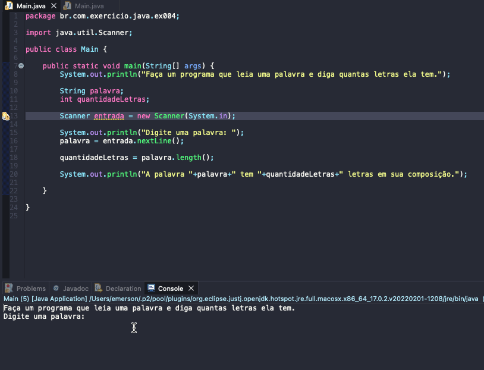

# Exercise - Counting letters
- Make a program that reads a word and tells you how many letters it has.

  
<b>Problem Description - PT-BR</b>

- Faça um programa que leia uma palavra e diga quantas letras ela tem.

## Application in use.

### Contact!

[Emerson Seiler](https://www.linkedin.com/in/seileremerson/)

