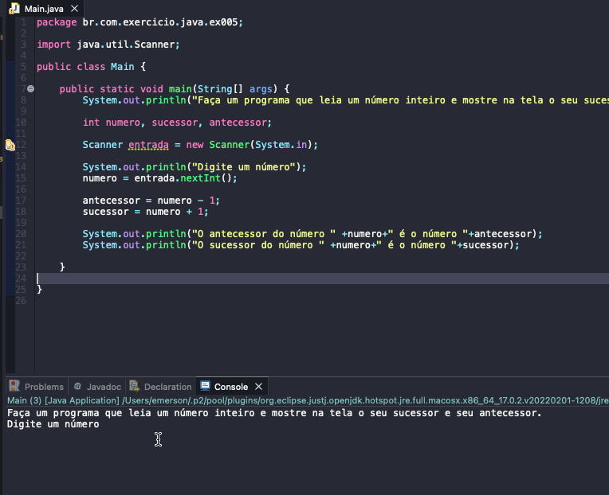

# Exercise - Successor and Predecessor
- Write a program that reads an integer and displays its successor and predecessor on the screen.

  
<b>Problem Description - PT-BR</b>

- Faça um programa que leia um número inteiro e mostre na tela o seu sucessor e seu antecessor.

## Application in use.

### Contact!

[Emerson Seiler](https://www.linkedin.com/in/seileremerson/)

