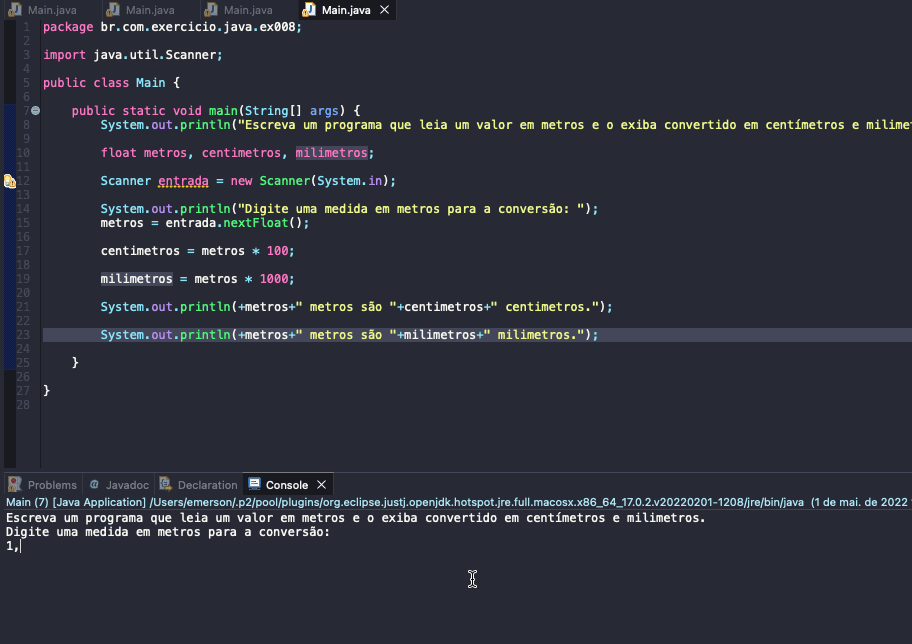

# Exercise - Convert Meters to Centimeters and Millimeters
- Write a program that reads a value in meters and displays it converted into centimeters and millimeters.

  
<b>Problem Description - PT-BR</b>

- Escreva um programa que leia um valor em metros e o exiba convertido em centímetros e milimetros.

## Application in use.

### Contact!

[Emerson Seiler](https://www.linkedin.com/in/seileremerson/)

