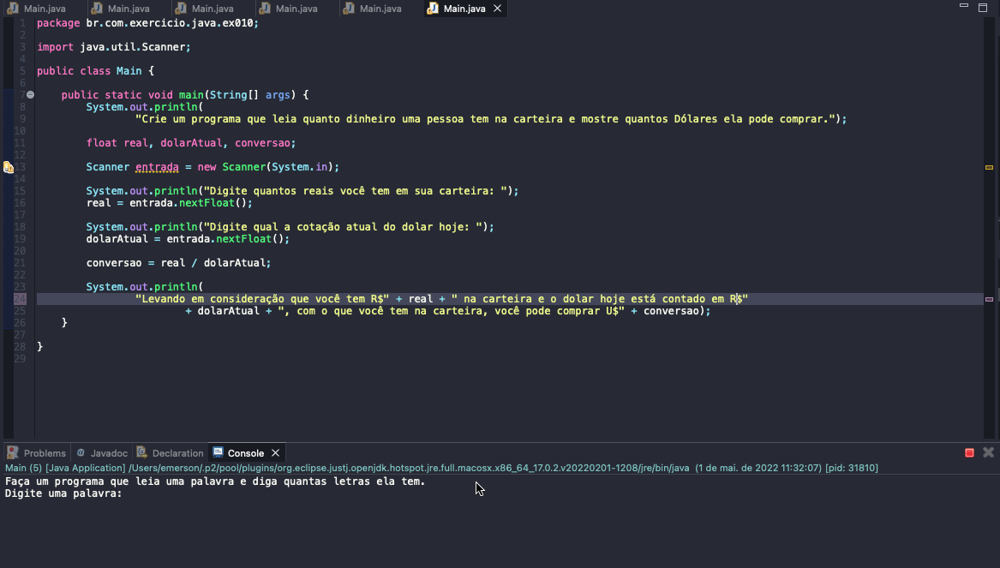

# Exercise - Real to dollar converter
- Create a program that reads how much money a person has in their wallet and shows how many Dollars they can buy.

  
<b>Problem Description - PT-BR</b>

- Crie um programa que leia quanto dinheiro uma pessoa tem na carteira e mostre quantos Dólares ela pode comprar.

## Application in use.

### Contact!

[Emerson Seiler](https://www.linkedin.com/in/seileremerson/)

