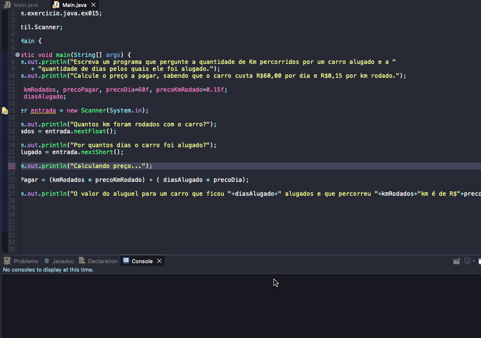

# Exercise - Car Rental Price
- Write a program that asks the number of kilometers traveled by a rented car and the number of days for which it was rented.
- Calculate the price to pay, knowing that the car costs R$60.00 per day and R$0.15 per km driven.

  
<b>Problem Description - PT-BR</b>

- Escreva um programa que pergunte a quantidade de Km percorridos por um carro alugado e a quantidade de dias pelos quais ele foi alugado.
- Calcule o preço a pagar, sabendo que o carro custa R$60,00 por dia e R$0,15 por km rodado.

## Application in use.

### Contact!

[Emerson Seiler](https://www.linkedin.com/in/seileremerson/)

