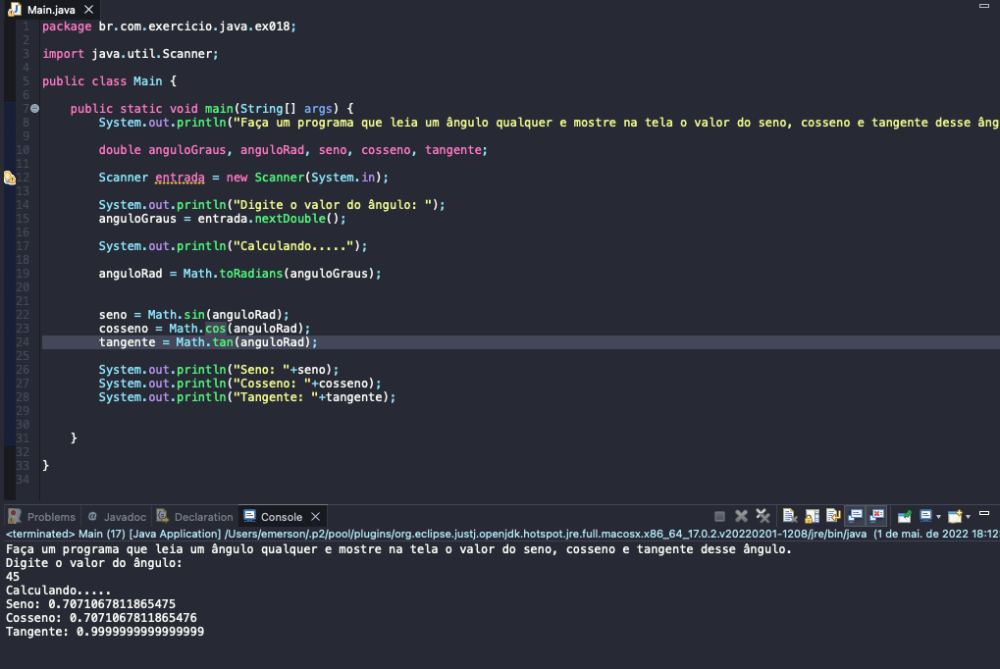

# Exercise - Sine/Cosine/Tangent Angle
- Write a program that reads any angle and displays the value of the sine, cosine and tangent of that angle on the screen.

  
<b>Problem Description - PT-BR</b>

- Faça um programa que leia um ângulo qualquer e mostre na tela o valor do seno, cosseno e tangente desse ângulo.

## Application in use.

### Contact!

[Emerson Seiler](https://www.linkedin.com/in/seileremerson/)

