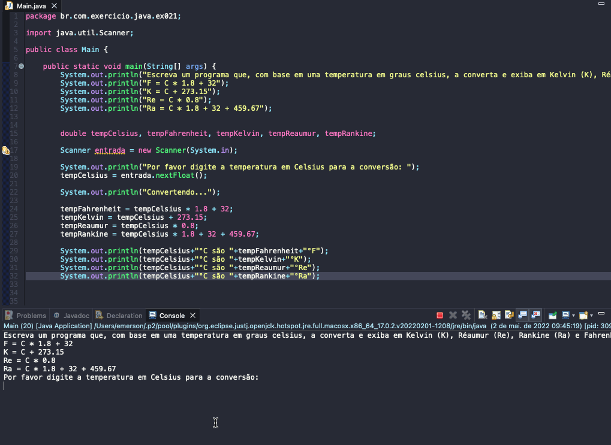

# Exercise - Temperature Converter
- Write a program that, based on a temperature in degrees Celsius, converts it and displays it in Kelvin (K), Réaumur (Re), Rankine (Ra) and Fahrenheit (F), following the formulas:
  - F = C * 1.8 + 32;
  - K = C + 273.15;
  - Re = C * 0.8;
  - Ra = C * 1.8 + 32 + 459.67;

  
<b>Problem Description - PT-BR</b>

- Escreva um programa que, com base em uma temperatura em graus celsius, a converta e exiba em Kelvin (K), Réaumur (Re), Rankine (Ra) e Fahrenheit (F), seguindo as fórmulas:
  - F = C * 1.8 + 32;
  - K = C + 273.15;
  - Re = C * 0.8;
  - Ra = C * 1.8 + 32 + 459.67;

## Application in use.

### Contact!

[Emerson Seiler](https://www.linkedin.com/in/seileremerson/)

