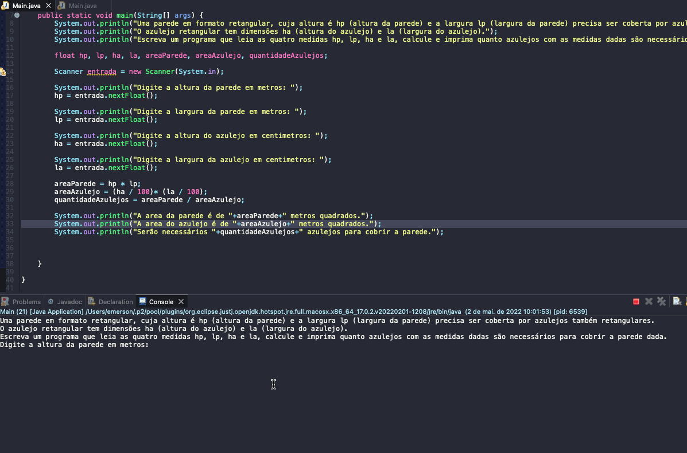

# Exercise - Wall Tiles
- A rectangular shaped wall, whose height is hp (wall height) and width lp (wall width) needs to be covered by rectangular tiles.
- The rectangular tile has dimensions ha (tile height) and la (tile width).
- Write a program that reads the four measurements hp, lp, ha and la, calculates and prints how many tiles with the given measurements are needed to cover the given wall.

  
<b>Problem Description - PT-BR</b>

- Uma parede em formato retangular, cuja altura é hp (altura da parede) e a largura lp (largura da parede) precisa ser coberta por azulejos também retangulares.
- O azulejo retangular tem dimensões ha (altura do azulejo) e la (largura do azulejo).
- Escreva um programa que leia as quatro medidas hp, lp, ha e la, calcule e imprima quanto azulejos com as medidas dadas são necessários para cobrir a parede dada.

## Application in use.

### Contact!

[Emerson Seiler](https://www.linkedin.com/in/seileremerson/)

