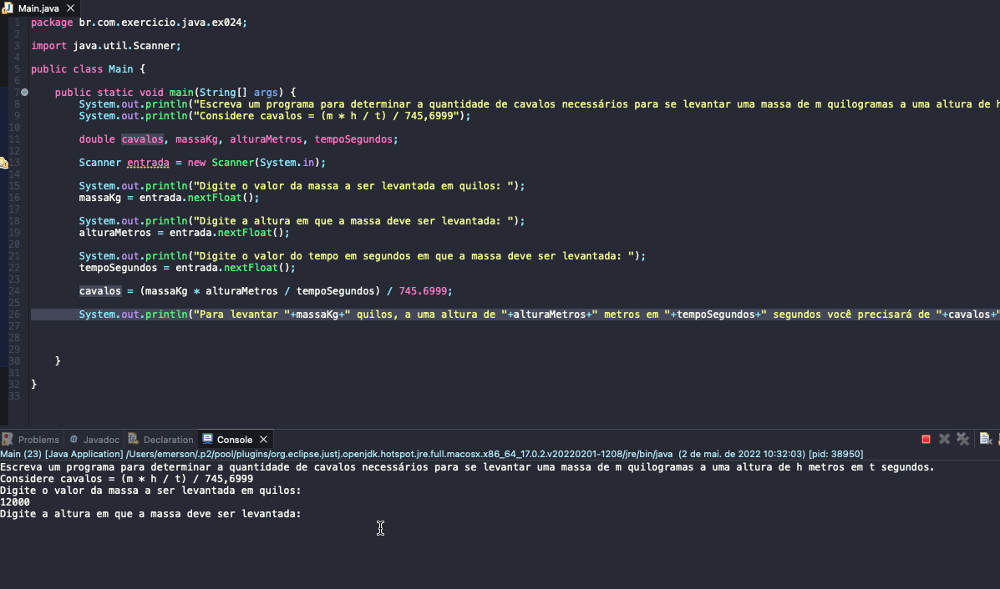

# Exercise - Number of Horses to Lift Mass
- Write a program to determine the number of horses needed to lift a mass of m kilograms to a height of h meters in t seconds.
- Consider horses = (m * h / t) / 745.6999.

  
<b>Problem Description - PT-BR</b>

- Escreva um programa para determinar a quantidade de cavalos necessários para se levantar uma massa de m quilogramas a uma altura de h metros em t segundos.
- Considere cavalos = (m * h / t) / 745,6999.

## Application in use.

### Contact!

[Emerson Seiler](https://www.linkedin.com/in/seileremerson/)

