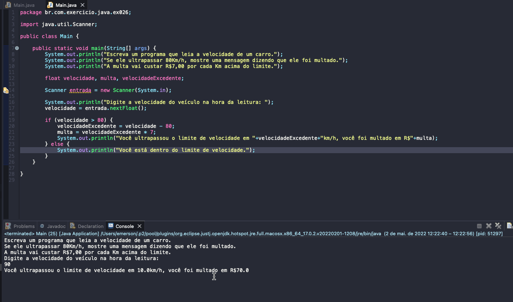

# Exercise - Electronic Radar
- Write a program that reads the speed of a car.
- If he exceeds 80Km/h, show a message saying he has been fined.
- The fine will cost R$7.00 for each km over the limit.

  
<b>Problem Description - PT-BR</b>

- Escreva um programa que leia a velocidade de um carro.
- Se ele ultrapassar 80Km/h, mostre uma mensagem dizendo que ele foi multado.
- A multa vai custar R$7,00 por cada Km acima do limite.

## Application in use.

### Contact!

[Emerson Seiler](https://www.linkedin.com/in/seileremerson/)

