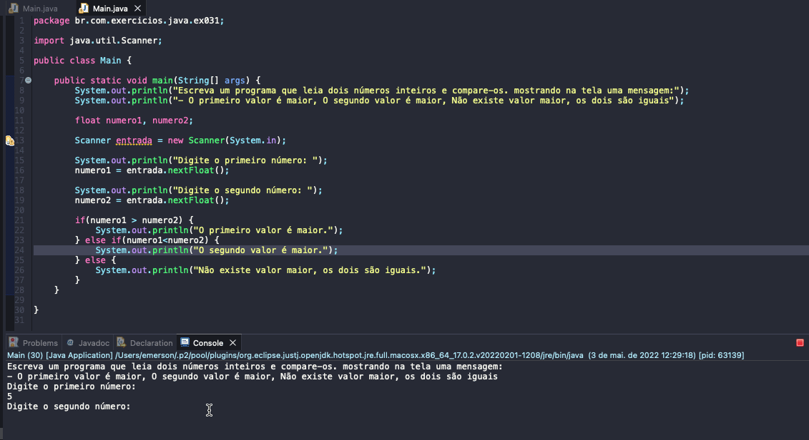

# Exercise - Comparing Values
- Write a program that reads two integers and compares them. showing on the screen a message according to the condition:
   - The first value is higher
   - The second value is higher
   - There is no greater value, both are equal
   

  
<b>Problem Description - PT-BR</b>

- Escreva um programa que leia dois números inteiros e compare-os. mostrando na tela uma mensagem de acordo com a condição:
  - O primeiro valor é maior
  - O segundo valor é maior
  - Não existe valor maior, os dois são iguais

## Application in use.

### Contact!

[Emerson Seiler](https://www.linkedin.com/in/seileremerson/)

