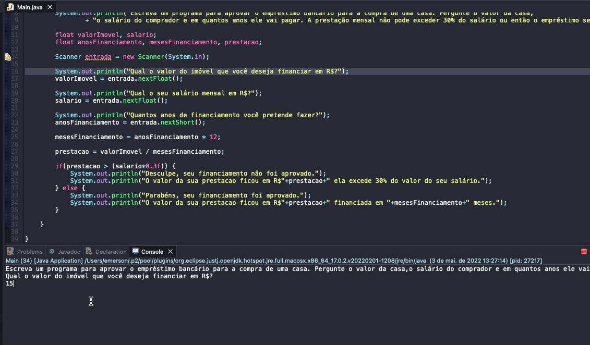

# Exercise - Real Estate Financing
- Write a program to approve the bank loan for the purchase of a house. Ask the value of the home, the buyer's salary and how many years he will pay. The monthly installment cannot exceed 30% of the salary or else the loan will be denied.

  
<b>Problem Description - PT-BR</b>

- Escreva um programa para aprovar o empréstimo bancário para a compra de uma casa. Pergunte o valor da casa, o salário do comprador e em quantos anos ele vai pagar. A prestação mensal não pode exceder 30% do salário ou então o empréstimo será negado.

## Application in use.

### Contact!

[Emerson Seiler](https://www.linkedin.com/in/seileremerson/)

