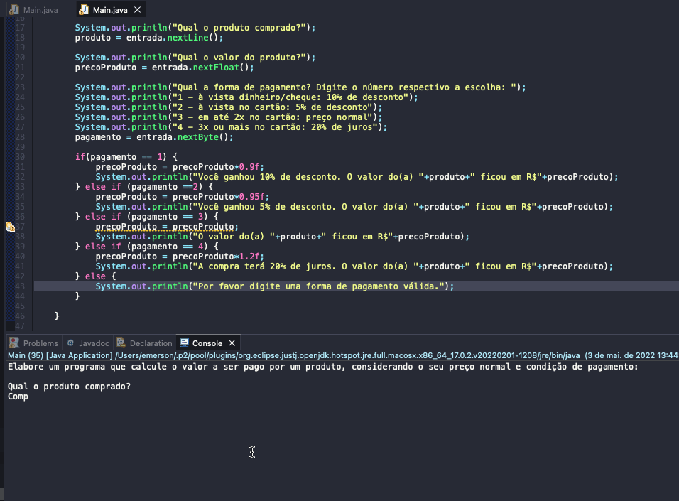

# Exercise - Product Price
- Create a program that calculates the amount to be paid for a product, considering its normal price and payment terms:
   - cash/check: 10% discount
   - cash on card: 5% discount
   - up to 2x on the card: normal price
   - 3x or more on the card: 20% interest

  
<b>Problem Description - PT-BR</b>

- Elabore um programa que calcule o valor a ser pago por um produto, considerando o seu preço normal e condição de pagamento:
  - à vista dinheiro/cheque: 10% de desconto
  - à vista no cartão: 5% de desconto
  - em até 2x no cartão: preço normal
  - 3x ou mais no cartão: 20% de juros

## Application in use.

### Contact!

[Emerson Seiler](https://www.linkedin.com/in/seileremerson/)

