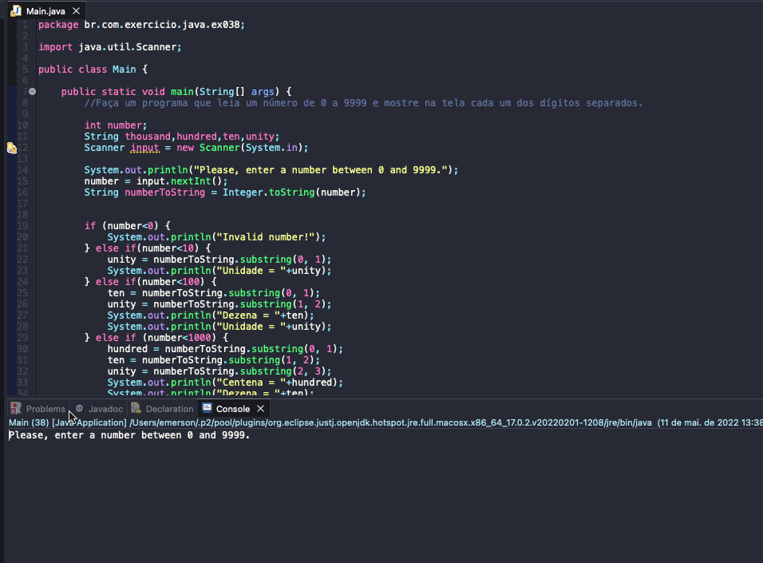

# Exercise - Specifying a number
- Write a program that reads a number from 0 to 9999 and displays each of the separate digits on the screen.

  
<b>Problem Description - PT-BR</b>

- Faça um programa que leia um número de 0 a 9999 e mostre na tela cada um dos dígitos separados.

## Aplicação em uso.

### Entre em contato!

[Emerson Seiler](https://www.linkedin.com/in/seileremerson/)

