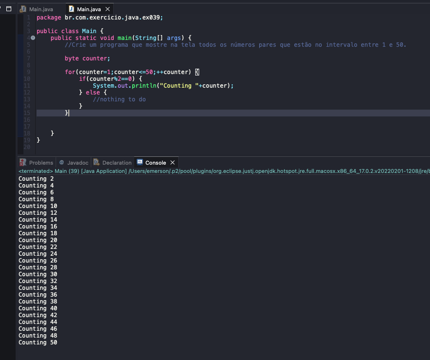

# Exercise - Counting numbers
- Create a program that displays on the screen all even numbers that are in the range between 1 and 50.

  
<b>Problem Description - PT-BR</b>

- Crie um programa que mostre na tela todos os números pares que estão no intervalo entre 1 e 50.

## Application in use.

### Contact!

[Emerson Seiler](https://www.linkedin.com/in/seileremerson/)

