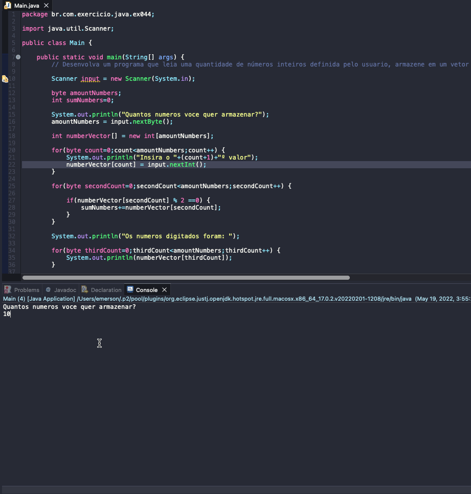

# Exercise - Store numbers in vector and add pairs
- Develop a program that reads a user-defined amount of integers, stores them in an array, and displays the sum of only those that are even. If the value entered is odd, disregard it.

  
<b>Problem Description - PT-BR</b>

- Desenvolva um programa que leia uma quantidade de inteiros definida pelo usuário, armazene-os em uma matriz e exiba a soma apenas daqueles que são pares. Se o valor informado for ímpar, desconsidere-o.

## Application in use.

### Contact!

[Emerson Seiler](https://www.linkedin.com/in/seileremerson/)

