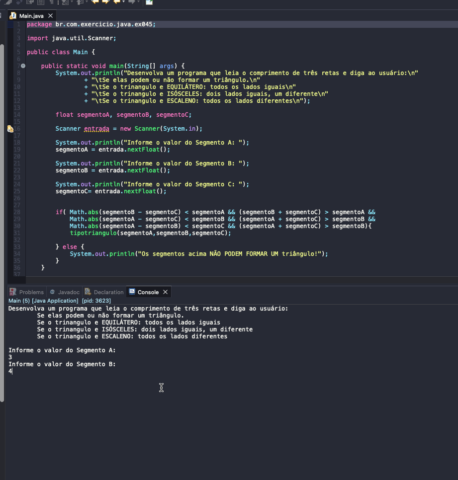

# Exercise - Triangle types
- Develop a program that reads the length of three lines and tells the user:
   - Whether or not they can form a triangle.
   - If the triangle is EQUILATERAL: all sides are equal.
   - If the triangle is ISOSCELES: two equal sides, one different.
   - If the triangle is SCALENE: all sides are different.

  
<b>Problem Description - PT-BR</b>

- Desenvolva um programa que leia o comprimento de três retas e diga ao usuário:
  - Se elas podem ou não formar um triângulo.
  - Se o trinangulo e EQUILÁTERO: todos os lados iguais.
  - Se o trinangulo e ISÓSCELES: dois lados iguais, um diferente.
  - Se o trinangulo e ESCALENO: todos os lados diferentes.

## Application in use.

### Contact!

[Emerson Seiler](https://www.linkedin.com/in/seileremerson/)

