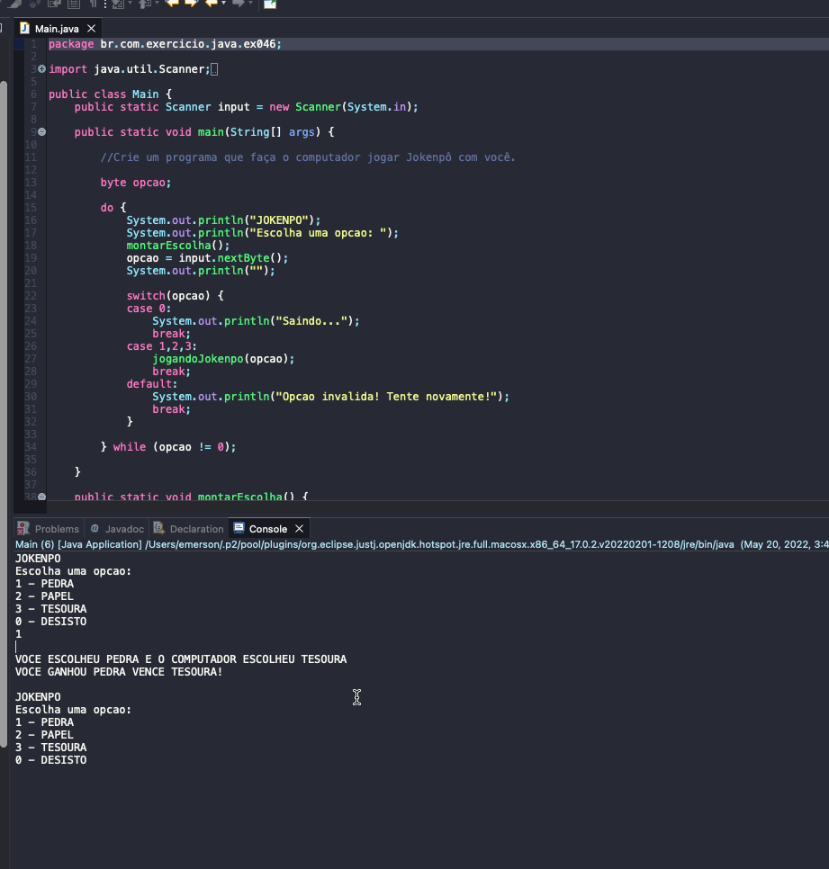

# Exercise - JOKENPO
- Create a program that makes the computer play Jokenpo with you.

  
<b>Problem Description - PT-BR</b>

- Crie um programa que faça o computador jogar Jokenpô com você.

## Application in use.

### Contact!

[Emerson Seiler](https://www.linkedin.com/in/seileremerson/)

