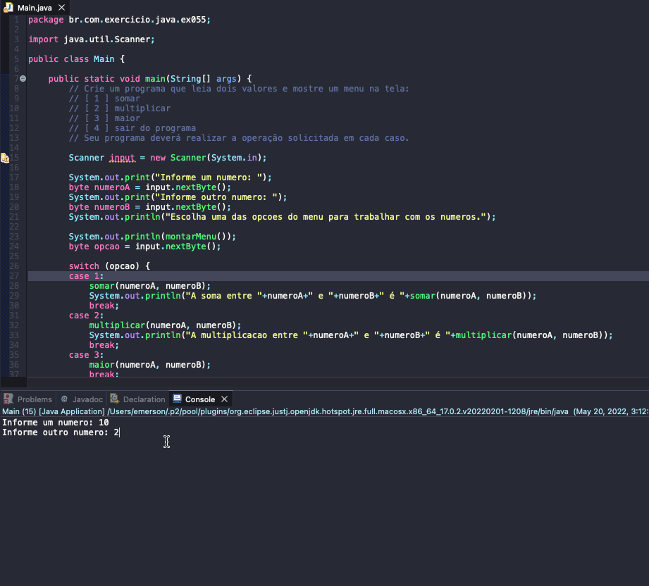

# Exercise - Calculator
- Create a program that reads two values and displays a menu on the screen:
   - [ 1 ] add
   - [ 2 ] multiply
   - [ 3 ] larger
   - [4] exit the program
- Your program must perform the requested operation in each case.

  
<b>Problem Description - PT-BR</b>

- Crie um programa que leia dois valores e mostre um menu na tela:
  - [ 1 ] somar
  - [ 2 ] multiplicar
  - [ 3 ] maior
  - [ 4 ] sair do programa
- Seu programa deverá realizar a operação solicitada em cada caso.

## Application in use.

### Contact!

[Emerson Seiler](https://www.linkedin.com/in/seileremerson/)

