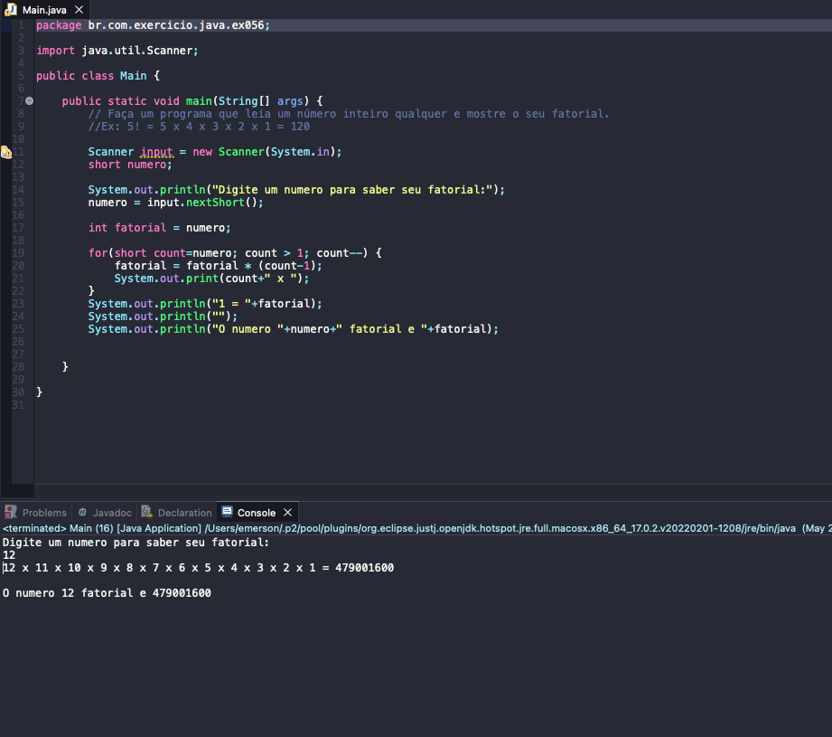

# Exercise - Factorial Number
- Write a program that reads any integer and displays its factorial.
- Ex: 5! = 5 x 4 x 3 x 2 x 1 = 120

  
<b>Problem Description - PT-BR</b>

- Faça um programa que leia um número inteiro qualquer e mostre o seu fatorial.
- Ex: 5! = 5 x 4 x 3 x 2 x 1 = 120

## Application in use.

### Contact!

[Emerson Seiler](https://www.linkedin.com/in/seileremerson/)

