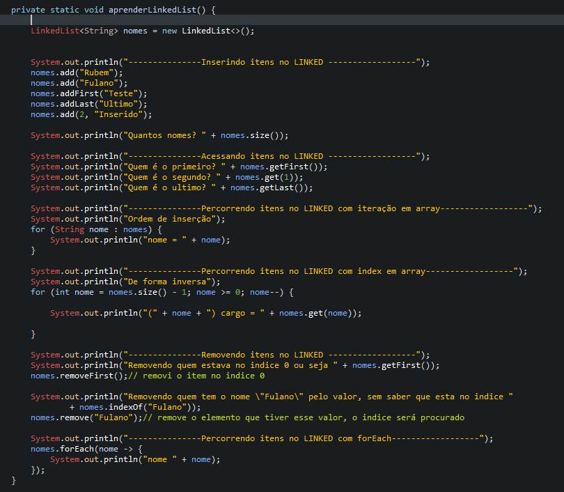

# Learning about ArrayList and LinkedList

## ArrayList
- Unlike vectors and arrays, collections are potentially infinite because their size can increase or decrease as needed and that's why the size attribute is now accessed through the size() method to make this difference clearer.

## Example

## ArrayList
- LinkedList has a similar purpose to ArrayList, but it has specific methods for managing the list

## Example

