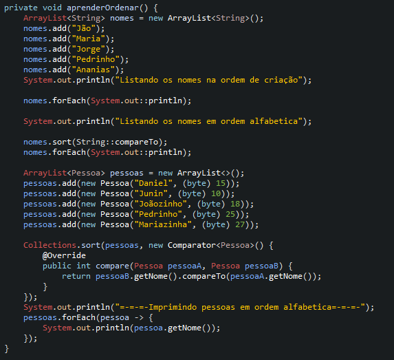

# Learning about Lambda Function

- Expressions are intended to reduce code generation effort and have a lot of power and performance in their execution.
- Widely used in Collections but it is also possible to do all kinds of actions with Lambda expressions

## Examples 

- List

- Filter

- Statistic

- Order
