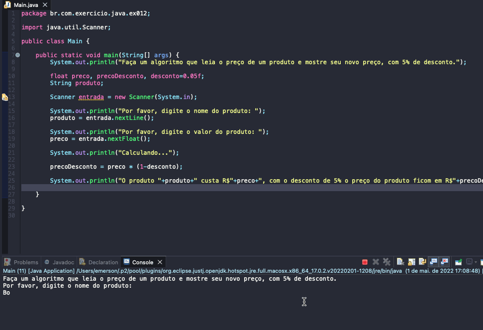

# Exercise - Discounted Price
- Make an algorithm that reads the price of a product and displays its new price, with a 5% discount.

  
<b>Problem Description - PT-BR</b>

- Faça um algoritmo que leia o preço de um produto e mostre seu novo preço, com 5% de desconto.

## Application in use.

### Contact!

[Emerson Seiler](https://www.linkedin.com/in/seileremerson/)

