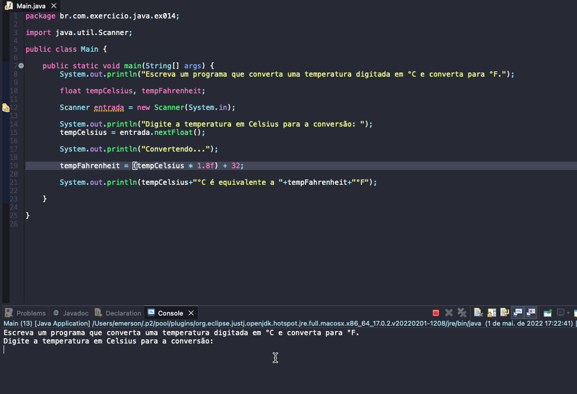

# Exercise - Celsius to Fahrenheit
- Write a program that converts a typed temperature to °C and converts it to °F.

  
<b>Problem Description - PT-BR</b>

- Escreva um programa que converta uma temperatura digitada em °C e converta para °F.

## Application in use.

### Contact!

[Emerson Seiler](https://www.linkedin.com/in/seileremerson/)

