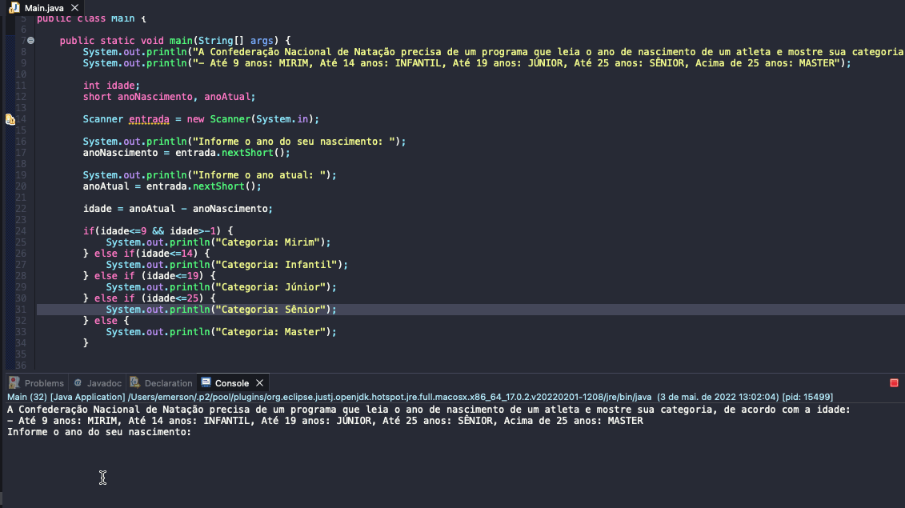

# Exercise - Military Enlistment
- The National Swimming Confederation needs a program that reads an athlete's year of birth and shows his category, according to age:
   - Up to 9 years: MIRIM
   - Up to 14 years: CHILDREN
   - Up to 19 years old: JUNIOR
   - Up to 25 years old: SENIOR
   - Over 25 years: MASTER

  
<b>Problem Description - PT-BR</b>

- A Confederação Nacional de Natação precisa de um programa que leia o ano de nascimento de um atleta e mostre sua categoria, de acordo com a idade:
  - Até 9 anos: MIRIM
  - Até 14 anos: INFANTIL
  - Até 19 anos: JÚNIOR
  - Até 25 anos: SÊNIOR
  - Acima de 25 anos: MASTER

## Application in use.

### Contact!

[Emerson Seiler](https://www.linkedin.com/in/seileremerson/)

