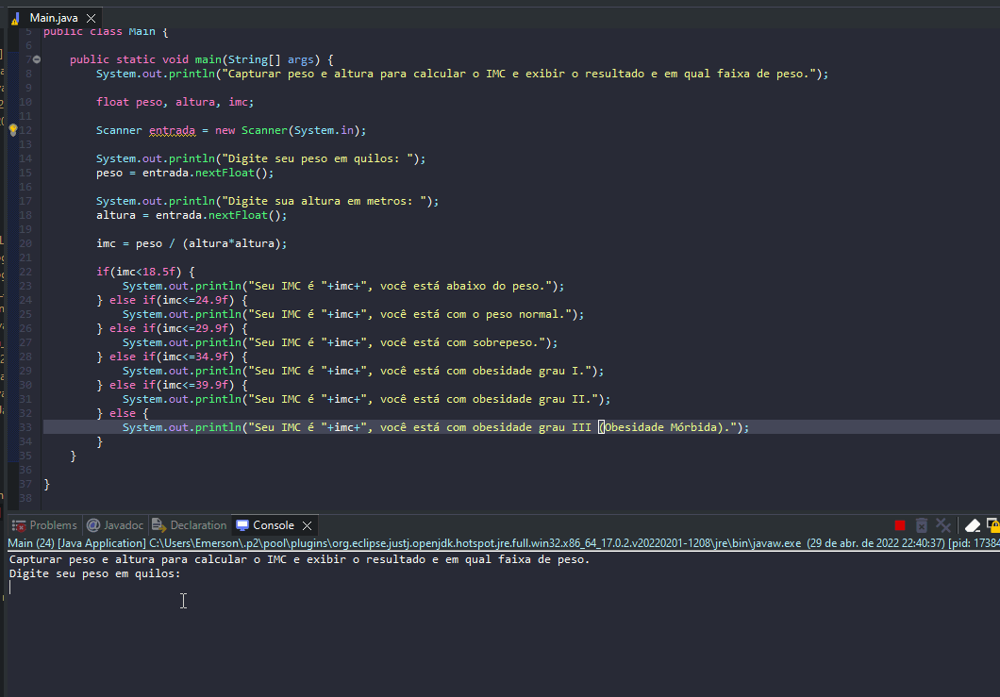

# Exercise - IMC Calculator
- Capture weight and height to calculate IMC and display the result and in which weight range.

  
<b>Problem Description - PT-BR</b>

- Capturar peso e altura para calcular o IMC e exibir o resultado e em qual faixa de peso.

## Application in use.

### Contact!

[Emerson Seiler](https://www.linkedin.com/in/seileremerson/)

