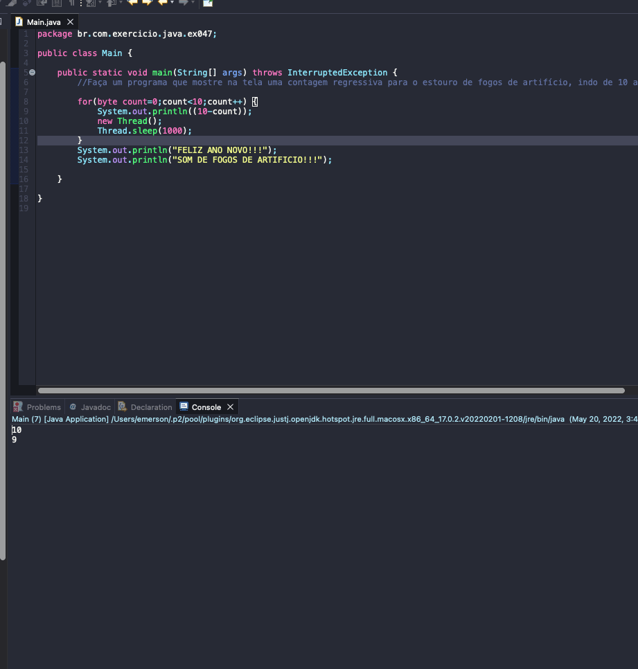

# Exercise - Countdown
- Write a program that displays a countdown to the burst of fireworks on the screen, going from 10 to 0, with a 1 second pause between them.

  
<b>Problem Description - PT-BR</b>

- Faça um programa que mostre na tela uma contagem regressiva para o estouro de fogos de artifício, indo de 10 até 0, com uma pausa de 1 segundo entre eles.

## Application in use.

### Contact!

[Emerson Seiler](https://www.linkedin.com/in/seileremerson/)

