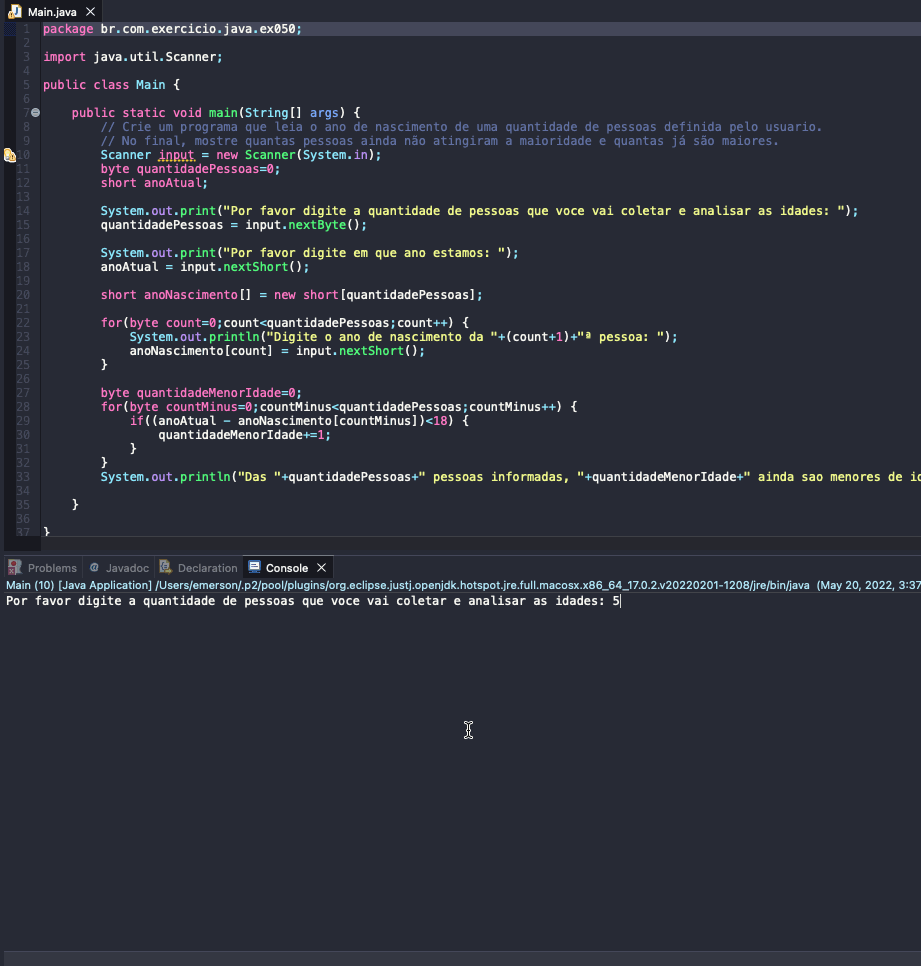

# Exercise - Analyzing ages list
- Create a program that reads the year of birth of a number of people defined by the user.
- At the end, show how many people have not yet reached the age of majority and how many are already older.

  
<b>Problem Description - PT-BR</b>

- Crie um programa que leia o ano de nascimento de uma quantidade de pessoas definida pelo usuario.
- No final, mostre quantas pessoas ainda não atingiram a maioridade e quantas já são maiores.

## Application in use.

### Contact!

[Emerson Seiler](https://www.linkedin.com/in/seileremerson/)

