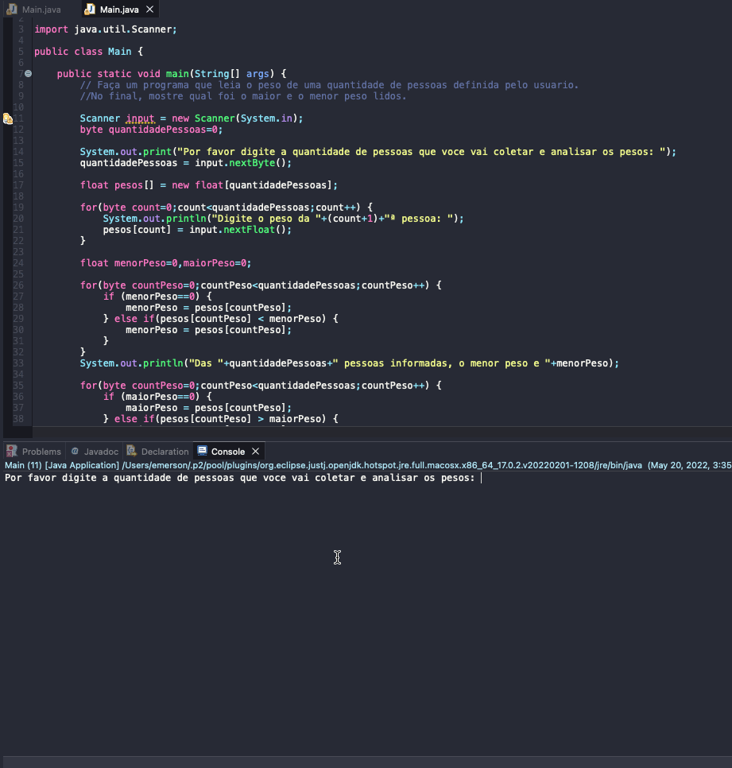

# Exercise - Analyzing Personal Data
- Make a program that reads the weight of a number of people defined by the user.
- At the end, show which was the highest and lowest weight read.

  
<b>Problem Description - PT-BR</b>

- Faça um programa que leia o peso de uma quantidade de pessoas definida pelo usuario.
- No final, mostre qual foi o maior e o menor peso lidos.

## Application in use.

### Contact!

[Emerson Seiler](https://www.linkedin.com/in/seileremerson/)

